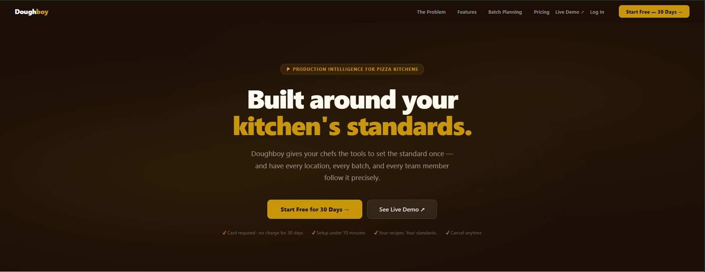
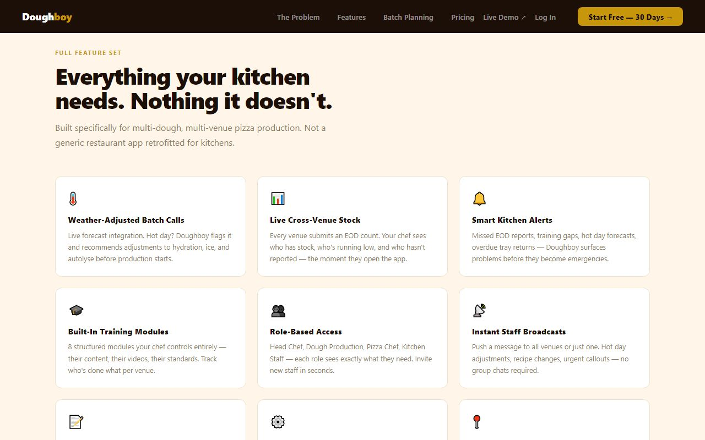
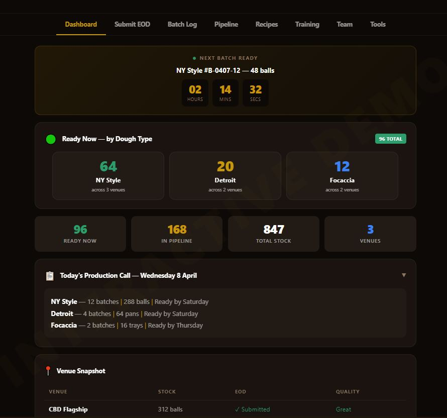

# Doughboy

**Pizza production intelligence for multi-venue kitchens.**

Track every batch. Configure every dough. One exec chef in control across every location.

🌐 **Live demo:** [c-moir.github.io/doughboy-marketing](https://c-moir.github.io/doughboy-marketing/)
🔗 **Production app:** [doughboy-prd.vercel.app](https://doughboy-prd.vercel.app)

---

## What it is

Doughboy is the system that keeps pizza dough consistent across multiple venues. Your exec chef configures the recipes, hydration, autolyse, and method. Production staff select a dough type and the parameters pre-fill. Every batch is logged. Every venue stays on standard.

Built for kitchens that have outgrown WhatsApp groups and shared spreadsheets.

*Production intelligence for every venue, every shift.*

---

## What it does

- **Live dashboard.** Stock levels, batch pipeline, and compliance across every venue at once.
- **Multi-dough configuration.** NY Style, Detroit, Focaccia, Neapolitan, sourdough, gluten-free. Each with its own hydration, fermentation, and method notes.
- **Weather-adjusted recommendations.** Hot day forecast? Doughboy flags it and pre-suggests adjustments before production starts.
- **Batch planning and history.** Weekly production calendar. Actual vs target tracking. Patterns over weeks.
- **Cross-venue stock tracking.** Live counts from every kitchen. Spot shortages before service.
- **Training management.** 8-module system. Per-venue progress tracking. Exec chef owns the content.
- **Staff broadcasts.** One message, every venue. Acknowledged or not.
- **Role-based access.** Exec Chef, Head Chef, Dough Production, Pizza Chef - each role sees only what they need.

*Everything your kitchen needs. Nothing it doesn't.*

---

## Multi-dough, by design

Most kitchens don't make one dough. Doughboy was built around that from day one. NY Style, Detroit, Focaccia, Neapolitan, sourdough, gluten-free - each dough type is its own preset with its own parameters. Switch at production time and everything pre-fills.

---

## Pricing

30-day free trial. Full access. No card. Keep everything when you upgrade.

| Tier | Price (AUD/mo) | Built for |
| :--- | :--- | :--- |
| **Starter** | $79 | One venue, one team. Tight, consistent dough. |
| **Multi-Venue** | $129 | Up to 5 venues. One exec chef in control. *Most popular.* |
| **Enterprise** | Talk to us | 6+ venues, franchise groups, custom requirements. |

### Starter ($79/mo AUD)
- 1 venue
- Up to 3 dough type presets
- Batch log + history
- EOD reporting
- Weather recommendations
- 8-module training system
- 30-day free trial

### Multi-Venue ($129/mo AUD)
- Up to 5 venues
- Unlimited dough type presets
- Live cross-venue stock dashboard
- Smart exec alert system
- Per-venue training tracking
- Weekly production calendar
- Staff broadcast system
- 30-day free trial

### Enterprise (custom)
- Unlimited venues
- Custom onboarding
- Dedicated support
- Custom training content
- White-label option
- Priority feature requests

🔒 *Founding customer rate available before public launch.*

---

## Live demo

*The live dashboard. Stock levels, compliance, and batch pipeline across all venues.*

Try the interactive demo: [c-moir.github.io/doughboy-marketing/demo.html](https://c-moir.github.io/doughboy-marketing/demo.html)

---

## FAQ

**Do you provide the recipes?**
No, and that's intentional. Your exec chef enters their own recipes, hydration targets, autolyse settings, method notes. Doughboy enforces your standards, not ours. Your IP stays yours.

**Can we add our own dough types?**
Yes. NY Style, Detroit, Focaccia, Neapolitan, sourdough, gluten-free. Any dough you produce can be configured as a preset.

**Does it work across multiple venues?**
That's exactly what it's built for. Each venue submits their own EOD count, tracks their own training, gets their own alerts. The exec chef sees it all in one dashboard.

**Do I need to install anything?**
Nothing. Doughboy runs in any browser - phone, tablet, computer. No app store, no IT setup.

**What if we make more than pizza?**
Doughboy tracks any fermented dough production - pizza, focaccia, flatbreads, pan bread, calzone bases.

---

## Contact

📧 [info@streamables.live](mailto:info@streamables.live)

Built in Brisbane. © 2026.
